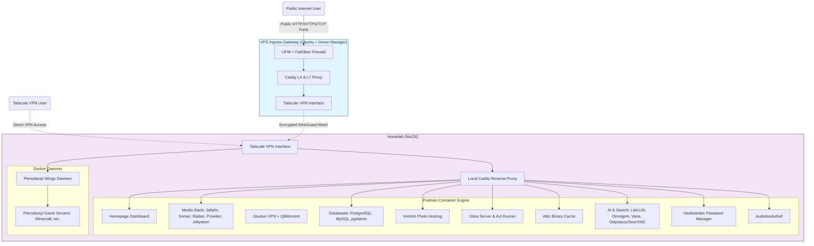

# ❄️ Tonga NixLab

> **A fully declarative, immutable infrastructure stack for self-hosting services, utilizing a hybrid architecture of NixOS and Nix-on-Ubuntu.**

  

  


## Overview

This repository contains the Infrastructure as Code (IaC) configuration for the **Tonga** homelab and its public-facing gateway. The core philosophy of this project is **strict reproducibility**. By leveraging Nix flakes, every component of the server is defined in code.

### The Hybrid Challenge

While the goal is pure NixOS everywhere, the public gateway runs on an Oracle VPS which presented specific technical limitations preventing a full NixOS install. To maintain declarative rigor, I implemented a hybrid approach:

  * **Homelab:** Pure **NixOS** (Immutable system).
  * **VPS Gateway:** **Ubuntu** bootstrapped with **Nix + Home Manager** (Declarative user-space).

## 🏗 Architecture
> “This containers revolution is changing the basic act of software consumption. It’s redefining this much more lightweight, portable unit, or atom, that is much easier to manage… It’s a gateway to dynamic management and dynamic systems.” – Craig McLuckie, Google.

The network utilizes a **Zero Trust** model. No ports are open to the public internet on the Homelab's public IP. All ingress traffic is routed through the VPS Ingress Gateway via a Tailscale mesh VPN, or accessed directly by authorized clients connected to the Tailscale subnet.



---

## 🔒 Network Architecture (Public vs. Private)

The network is split into two distinct boundaries:

### 1. VPS Gateway & Ingress (Public-Facing Setup)
The Oracle Cloud VPS running Ubuntu acts as a public bastion host, shielding the home network's IP address:
* **UFW & Fail2Ban:** UFW blocks all unapproved ingress traffic. Fail2Ban automatically blocks IPs that show suspicious activity (e.g., failed SSH attempts), while whitelisting the Tailscale range (`100.0.0.0/8`).
* **Tailscale Interface:** Establishes a secure, encrypted WireGuard tunnel to the Homelab.
* **Caddy (Layer 4 & Layer 7 Proxy):**
  * **Layer 4 (TCP Proxying):** Proxies raw TCP connections directly over Tailscale to the Homelab (Minecraft server range `25565-25600`).
  * **Layer 7 (HTTP/HTTPS Reverse Proxying):** Proxies HTTP requests for public-facing subdomains (e.g. `tv.*`, `vault.*`, `photos.*`, `foundry.*`, `audiobooks.*`) to their respective ports/services on the Homelab.

### 2. Homelab Gateway (Private-Facing Setup)
The home server runs NixOS behind a Zero Trust firewall where no public ports are forwarded:
* **Tailscale Tunnel:** Only devices authenticated to the Tailscale mesh network can communicate directly with the server.
* **Caddy Reverse Proxy:** Resolves wildcard certificates locally (`*.tongatime.us`) using Cloudflare DNS ACME challenges. 
* **IP Restriction Matchers:** Internal-only subdomains (e.g. `ai.*`, `omni.*`, `search.*`, `litellm.*`, `sonarr.*`, `radarr.*`, `prowlarr.*`, `qbit.*`, `bookshelf.*`, `seerr.*`, `mysql.*`, `postgres.*`) use the `@external` Caddy rule to drop connections returning a `403 Access Denied` unless they originate from the Tailscale subnet (`100.64.0.0/10`), the local LAN (`192.168.0.0/16`), or localhost (`127.0.0.0/8`).

---

## 🖥️ Services & Active Containers

The Homelab currently hosts the following containerized workloads across two backend engines (Podman for system-defined declaratives, and Docker for user-controlled game servers):

### 🏠 Core Services
* **Homepage Dashboard** (`tongatime.us`) - Service monitoring dashboard showing service metrics, server hardware utilization, and Docker/Podman container run statuses. Uses a secure Docker socket proxy (`docker-socket-proxy`) to read stats safely.
* **Proxmox VE** (`proxmox.tongatime.us`) - Hypervisor web GUI for virtual machines and hosts management.
* **Gitea Server** (`git.tongatime.us`) - Lightweight git service configured with GitHub repository mirroring and Action integration.
* **Act Runner** (Internal) - Gitea Action runner container utilizing Podman sockets to execute CI/CD workflows.
* **Attic Binary Cache** (`cache.tongatime.us`) - Nix binary cache server for caching NixOS rebuild closures to minimize compilation times.

### 🎬 Media Suite & Downloader Stack
* **Jellyfin** (`tv.tongatime.us` / Public Proxy) - Open-source media streaming server.
* **Sonarr** (`sonarr.tongatime.us` / Internal Only) - Automates TV series monitoring and management.
* **Radarr** (`radarr.tongatime.us` / Internal Only) - Automates movie monitoring and management.
* **Prowlarr** (`prowlarr.tongatime.us` / Internal Only) - Integrates indexers and tracker queries with Sonarr/Radarr.
* **QBittorrent** (`qbit.tongatime.us` / Internal Only) - BitTorrent client configured with a WebUI.
* **Gluetun VPN** (Internal) - VPN client container establishing a wireguard connection (ProtonVPN) through which qbittorrent is routed to secure torrent downloads.
* **Jellyseerr** (`seerr.tongatime.us` / Internal Only) - Request management and media discovery platform for Jellyfin.
* **Audiobookshelf** (`audiobooks.tongatime.us` / Public Proxy) - Audiobook and podcast server.
* **Bookshelf** (`bookshelf.tongatime.us` / Internal Only) - Readarr-based eBook and audiobook manager.

### 🧠 AI & Privacy-First Search (Internal Only)
* **LiteLLM Deepseek Proxy** (`litellm.tongatime.us`) - A Python HTTP interceptor proxy script. It catches Deepseek API requests, stripping out incompatibilities like `json_schema` response formats and converting them to `json_object` configurations to support prompt compliance.
* **Omnigent Server** (`omni.tongatime.us`) - AI agent orchestration server connecting to its dedicated PostgreSQL backend.
* **Vane Search UI** (`search.tongatime.us`) - A modern search frontend client pointing to SearXNG.
* **Odysseus / SearXNG** (`ai.tongatime.us`) - Privacy search engine instance (SearXNG) routed through Gluetun VPN to protect search traffic origin.

### 🗄️ Databases & Cache Databases
* **PostgreSQL** (Port `5432` / Internal Only) - Primary database instance backing core applications, tuned for high performance.
* **MySQL** (Port `3360` / Internal Only) - Relational database engine backing services.
* **pgAdmin** (`pgadmin.tongatime.us` / Internal Only) - Graphical interface for Postgres database administration.

### 🎮 Game Hosting (Pterodactyl Stack)
* **Pterodactyl Panel** (`panel.tongatime.us`) - Web dashboard for deploying and controlling game servers.
* **Pterodactyl Wings** (`node.tongatime.us`) - Privileged daemon running directly on the host. Connects to Docker to spawn, start, and manage individual sandbox game server containers (like Minecraft).

### 🔑 Security & Backups
* **Vaultwarden** (`vault.tongatime.us` / Public Proxy with signups disabled, `vault-direct.tongatime.us` / Internal Only) - Bitwarden-compatible password manager API, supporting SSH keys.
* **Immich Photos** (`photos.tongatime.us`) - High-performance backup and photo library platform featuring machine learning server workers, Valkey key-value cache database, and vector-enabled PostgreSQL databases.

---

## Key Features

### 🛡️ Secure Ingress Gateway
* **Caddy L4/L7 Hybrid:** An Oracle VPS exposes public ports, handles network routing over Tailscale, and uses `caddy-l4` to proxy raw TCP traffic (Minecraft game servers).
* **WireGuard VPN Mesh:** Tailscale secures traffic between nodes. The VPS restricts external traffic, while whitelisting the Tailscale subnet (`100.0.0.0/8`). UFW and Fail2Ban protect the host.

### ❄️ Declarative Infrastructure
* **Reproducible Configuration:** Services and ports are configured in Nix, ensuring a declarative build that avoids drifted configurations.
* **Automatic SSL:** Cloudflare DNS challenges enable Caddy to generate wildcard certificates (`*.tongatime.us`) without exposing HTTP port 80/443 directly.
* **Persistent Data Directories:** Explicitly configured directory mapping (`systemd.tmpfiles.rules`) ensures precise directory permissions (e.g. UID 1000/media or UID 5050/pgadmin) for containers.

### 🚀 Reproducible Deployment Environment
* **Hermetic Container Deployer:** The deployer runs inside a custom container definition (`Containerfile`) packing `nixos-rebuild`, SSH keys, and Nix configurations.
* **VPS Bootstrapper:** `deploy-vps.sh` installs the Nix package manager, sets up trusted users, configures swap files, opens required firewall ports via UFW, and activates the Home Manager configuration.

---

## 🛠️ Technical Stack

| Component | Technology | Description |
| :--- | :--- | :--- |
| **OS (Home)** | NixOS 25.05 | Pure, declarative, and immutable Linux system. |
| **OS (VPS)** | Ubuntu + Home Manager | Hybrid user-space configuration on traditional Linux. |
| **OCI Backend** | Podman + Docker | Podman for declarative services; Docker for Pterodactyl-managed game instances. |
| **Dashboard** | Homepage | Centralized homelab metrics and status dashboard. |
| **DNS** | DNSControl | Declarative DNS configuration for Cloudflare DNS zones. |
| **Secrets** | sops-nix | SOPS-encrypted secrets integrated natively with Nix. |
| **Storage** | Disko | Declarative ZFS/EXT4 partition layouts. |
| **Networking** | Tailscale | Encrypted mesh VPN for private node communications. |
| **Proxy** | Caddy | Web proxy handling Layer 4 TCP proxying and Layer 7 reverse proxying. |
| **Databases** | PostgreSQL / MySQL / Valkey | Relational and key-value database engines backing containers. |

---

## 📂 Directory Structure

```graphql
.
├── build-deployer.sh     # Builds the deployment container
├── configuration.nix     # Main NixOS Homelab configuration
├── Containerfile         # Definition of the reproducible deployer image
├── containers/           # Service definitions (Podman/Docker)
│   ├── default.nix       # Imports active containers
│   ├── act_runner.nix    # Gitea Action Runner configuration
│   ├── attic.nix         # Attic binary cache configuration
│   ├── audiobookshelf.nix# Audiobookshelf configuration
│   ├── gitea.nix         # Gitea git server configuration
│   ├── homepage.nix      # Homepage dashboard and socket proxy config
│   ├── immich.nix        # Immich photos (server, ML, Valkey, Postgres)
│   ├── litellm.nix       # Deepseek python proxy script setup
│   ├── media.nix         # Media stack (Jellyfin, Sonarr, Radarr, Prowlarr, Gluetun VPN, QBittorrent, Bookshelf, Jellyseerr)
│   ├── mysql.nix         # MySQL database config
│   ├── observability.nix # Observability suite (Grafana, Prometheus, Loki, Promtail, Node Exporter)
│   ├── odysseus.nix      # SearXNG & Odysseus AI portal configurations
│   ├── omnigent.nix      # Omnigent AI server & PostgreSQL configurations
│   ├── pgadmin.nix       # pgAdmin Web client for Postgres
│   ├── postgres.nix      # Core PostgreSQL database configuration
│   ├── vane.nix          # Vane Search UI web client
│   ├── vaultwarden.nix   # Vaultwarden password manager configuration
│   ├── foundryvtt/       # FoundryVTT game server configurations
│   │   ├── foundry_chef.nix
│   │   ├── foundry_portal.nix
│   │   └── module.nix
│   └── pterodactyl/      # Pterodactyl Game Server Manager (DB, Redis, Panel, Worker, Wings)
│       └── default.nix
├── deploy-dns.sh         # Script to deploy DNS changes
├── deploy-nix.sh         # Script to deploy to Homelab
├── deploy-vps.sh         # Script to bootstrap and deploy to VPS
├── disko-config.nix      # ZFS/EXT4 partition layouts
├── flake.nix             # Entry point for system configurations
├── network/              # Networking configuration
│   ├── caddy.nix         # Reverse proxy & ACME settings
│   ├── dnsconfig.js      # DNSControl configuration
│   ├── dns_zones.yaml    # Declarative DNS zones
│   └── tailscale.nix     # VPN configuration
├── secrets/              # Encrypted secrets (sops-nix)
│   └── secrets.yaml
└── vps/                  # VPS-specific configuration
    ├── home.nix          # Home Manager config for Ubuntu
    └── configuration.nix # Partial system config (Unused/NixOS template)
```

---

## 🚀 Deployment Guide

👉 **Read [Deploying New Containers](docs/ADDING_CONTAINERS.md) for a step-by-step guide on adding and deploying new services.**

### Prerequisites
* Podman installed on your local machine.
* SSH access to target hosts.
* A `secrets/` directory (ignored by git) containing API tokens and private SSH keys.

### 1. The Deployer
Build the hermetic deployment environment. This ensures you are using the exact same version of `nix` and `nixos-rebuild` regardless of your host OS:
```bash
./build-deployer.sh
```

### 2. Deploying to Homelab (NixOS)
To update the main server:
```bash
./deploy-nix.sh          # Updates existing system
./deploy-nix.sh --install # Wipes disk and installs fresh (NixOS Anywhere)
```

### 3. Deploying to VPS (Ubuntu)
To bootstrap or update the gateway:
```bash
./deploy-vps.sh
```
*This script will SSH into the Ubuntu host, install the Nix package manager if missing, configure multi-user support, configure UFW/Fail2Ban, and apply the `homeConfigurations."ubuntu"` flake output.*

### 4. Managing DNS Records
To update DNS records declaratively:
```bash
./deploy-dns.sh          # Preview and push DNS changes
./deploy-dns.sh --revert backups/dns_zones_TIMESTAMP.yaml  # Revert to backup
```
*This script uses DNSControl to manage Cloudflare DNS zones from `network/dns_zones.yaml`. All changes are previewed before being applied.*

## 🗺️ Roadmap
> "Debugging is twice as hard as writing the code in the first place. Therefore, if you write the code as cleverly as possible, you are, by definition, not smart enough to debug it." - Brian Kernighan, Canadian

Future plans are documented in the project TODOs.

👉 **See [TODO.md](TODO.md) for the full roadmap.**

-----

**[View Source](https://github.com/taylorturnerit/nixserver)**

